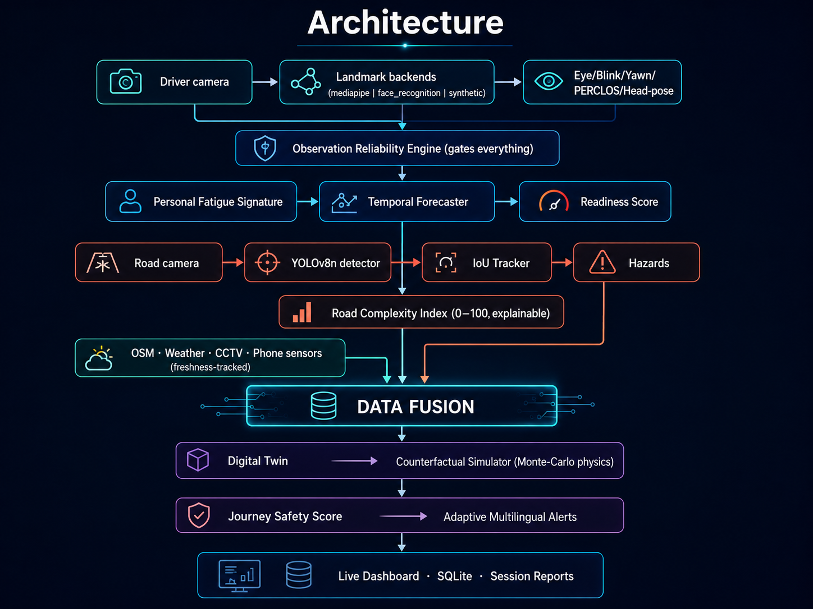

<div align="center">

# 🚗 BharatDrive-X Twin

### An offline-first AI safety co-pilot for Indian roads

*Personalized driver-readiness analysis · Indian road-hazard perception · Digital-twin counterfactual simulation · Explainable, fused risk recommendations*


**No cloud. No API keys. No GPU. Runs on a laptop.**

</div>

---

## 💡 The idea

Most drowsiness detectors do one thing: *if eyes closed for N frames → beep.* One threshold for every human, no context, no foresight.

BharatDrive-X Twin asks a bigger question: **"Given who this driver is right now, and what this specific Indian road is doing, what is the lowest-risk next move — and why?"**

It fuses **two live perception streams at once** — a driver-facing camera watching for fatigue and a road-facing camera detecting Indian hazards — into a single, explainable safety picture. Neither signal alone is enough; a drowsy driver on an empty road and an alert driver in dense traffic are different risks, and only the *combination* tells the real story.

---

## ✅ What actually works (verified, not aspirational)

The driver monitor and the road detector run **simultaneously in one loop** and fuse into a unified Journey Safety Score. Here is a real frame from a live fused run (`--road dashcam.mp4 --driver live`):

| Panel | Live output |
|---|---|
| **Driver readiness** | 68 / 100 · reliability **90% (EXCELLENT)** · fatigue risk 19% · EAR 0.180 / personal thr 0.149 |
| **Road** | Complexity 9/100 · **4 live detections** — car ahead ~5.8 m, car right ~6.4 m, car left ~9.1 m (`front_camera`, YOLO) |
| **Simulation** | `live:dashcam` → recommended **"Continue at current speed"**, est. risk 27% (confidence High) |
| **Journey Safety** | **72 / 100 · Danger: Low · Confidence: High** — labelled *FUSED ESTIMATE* |
| **System** | 25 FPS · 12 ms loop latency · CPU only |

In the same run the alert manager correctly interleaved **road** alerts (L3 pedestrian right, L3 motorcycle ahead) with a **driver** alert (L2 fatigue) and context (L1 congestion) — real fusion, by severity, no false criticals.

### Measured road-hazard detector (`models/indian_hazards.pt`)

YOLOv8n fine-tuned on IDD Detection + RDD2022 India — **10 classes**, evaluated on 1,648 held-out images (no leakage), CPU inference **24.6 ms/image**:

| Overall | P | R | mAP50 | mAP50-95 |
|---|---|---|---|---|
| 10-class | 0.672 | 0.401 | **0.442** | 0.248 |

Strongest classes: truck (mAP50 **0.75**), motorcycle (0.67), car (0.60). Full per-class table and honest caveats in [`docs/EVALUATION_LOG.md`](docs/EVALUATION_LOG.md).

---

## 🎬 Run it in 60 seconds

```bash
git clone https://github.com/CODEX038/BharatDrive-x-Twin.git
cd BharatDrive-x-Twin
pip install -r requirements.txt

# scripted end-to-end demo (no camera needed) → open http://localhost:8765
python -m app.main --demo --dashboard
```

```bash
# live driver monitoring from your webcam
python -m app.main --live --dashboard

# FUSED mode — trained YOLO on a road video + your live webcam, combined
python -m app.main --road datasets/raw/road_videos/dashcam.mp4 --driver live --dashboard

python -m app.main --list-scenarios     # 6 bundled Indian road scenarios
python -m app.main --legacy             # the original notebook, preserved
pytest tests/                           # deterministic suite, no camera required
```

---

## 🏗️ Architecture

<div align="center">



</div>

<details>
<summary>Text version of the architecture</summary>

```
 Driver camera ──► Landmark backends ──► Eye/Blink/Yawn/PERCLOS/Head-pose
 (mediapipe │ face_recognition │ synthetic)        │
                                                   ▼
                    Observation Reliability Engine (gates everything)
                                                   │
                    Personal Fatigue Signature ──► Temporal Forecaster ──► Readiness Score
                                                                               │
 Road camera ──► YOLOv8n detector ──► IoU Tracker ──► Hazards ────────────────┤
                                                   │                           │
                                    Road Complexity Index (0–100, explainable) │
                                                   │                           │
 OSM · Weather · CCTV · Phone sensors ─────────────┤   (freshness-tracked)     │
                                                   ▼                           ▼
                                        ┌─────────────────────────────────────────┐
                                        │            DATA FUSION                   │
                                        └───────────────────┬─────────────────────┘
                                                            ▼
                       Digital Twin ──► Counterfactual Simulator (Monte-Carlo physics)
                                                            ▼
                          Journey Safety Score ──► Adaptive Multilingual Alerts
                                                            ▼
                              Live Dashboard · SQLite · Session Reports
```

</details>

---

## 🔍 Engineering highlights

| | What | Why it stands out |
|---|---|---|
| 🔗 | **True sensor fusion** | Driver state × road hazards combine into one alert level and one Journey Safety Score — a critical driver state *caps* the score so a calm road can never average away a drowsy driver |
| 🧠 | **Personalized, not textbook** | Closed-eye threshold = ~65% of *your own* median EAR, learned from reliable alert-state windows with 3×MAD outlier rejection — detects deviation from *you* |
| 🩺 | **Calibrated alerting (case study)** | A documented debugging pass eliminated false-critical alarms: split fatigue-vs-hazard messages, added CRITICAL confirmation dwell, broke a self-locking baseline loop, floored the robust-z MAD, and de-jittered head-nod detection — max false risk dropped 0.93 → 0.65 |
| 🕶️ | **Knows what it doesn't know** | A dedicated reliability engine: an invisible eye is *unknown*, never *closed*; a missing face is *investigated*, never *recovering* |
| ⏱️ | **Timestamp-based everything** | No frame-count logic anywhere; behaviour is identical at 10 FPS and 60 FPS |
| 🎲 | **Seeded Monte-Carlo simulation** | 60 perturbed rollouts per candidate action → risk *and* uncertainty, fully reproducible; fatigue scales assumed reaction time |
| 🗣️ | **Multilingual graded alerts** | 5 levels, English / हिंदी / मराठी, with cooldown + duplicate suppression + escalation |
| 📊 | **Zero-dependency dashboard** | Live web UI on Python stdlib alone — every value labelled Measured / Estimated / Simulated / Fused / Unavailable |
| 🔬 | **Built-in diagnostics** | `scripts/analyze_session.py` replays any session from SQLite and ranks *exactly which signals* drove the risk — how the alert tuning above was measured |
| 🔒 | **Privacy by design** | Local processing, geometric landmarks only (no identity), zero raw-video storage by default, consent-gated recording, secrets in `.env` |

---

## 🛣️ Bundled Indian road scenarios

`motorcycle_cut_in` · `pothole_blind_turn` · `cattle_on_road` · `wrong_side_vehicle` · `unmarked_speed_breaker` · `drowsy_near_junction`

Each is a JSON world-state + timed detection playback + scripted driver behaviour — add your own by dropping a file into `digital_twin/scenarios/`.

---

## 📁 Repository map

```
app/                 entry point, config, CLI modes (demo · live · fused · legacy)
driver_monitoring/   landmarks · eye/blink/yawn · PERCLOS · head pose · reliability
                     fatigue signature · forecasting · readiness · state machine
road_perception/     YOLOv8n detector · IoU tracking · Road Complexity Index
digital_twin/        world state · 6 Indian scenarios · guarded SUMO hook
simulation/          physics (TTC, stopping distance) · Monte-Carlo action engine
fusion/              Journey Safety Score + prediction horizons
alerts/              graded multilingual alerts
dashboard/           zero-dependency live web dashboard
storage/             SQLite persistence + session reports
scripts/             training + analyze_session.py session diagnostics
legacy/              the original notebook, preserved and runnable
docs/                audit report · system design · evaluation log
tests/               deterministic pytest suite (synthetic, no camera)
```

---

## ⚖️ Honest limits (read before quoting numbers)

This is a **research and driver-assistance prototype**. It observes, estimates, simulates, explains, and warns — it never controls a vehicle, never contacts anyone, and is not medically validated or automotive-certified.

- Simulation risks are **estimates**, not real-world probabilities; monocular distances are approximate.
- The road side currently reads a **video file**, not a live second camera (no live dashcam capture path yet).
- The fatigue-risk model is an interpretable **hand-weighted heuristic** tuned for the dlib EAR scale, running here on MediaPipe against a 30-second personal baseline. Under good lighting it produces no false critical alerts, but it can still emit mild L2 "fatigue increasing" cautions on a fully-awake driver as natural EAR drift is scored against the fixed baseline. This is documented, with the fix path (rolling baseline adaptation, weight re-fit / labelled ML model), in `docs/EVALUATION_LOG.md`.
- Testing so far is single-subject; subject-independent (LOSO) evaluation is future work.

## 🗺️ Roadmap

Rolling baseline adaptation + forecaster re-fit for the MediaPipe EAR scale → live road-camera capture path → subject-independent evaluation (LOSO) on UTA-RLDD/NTHU → smartphone sensor fusion over WebSocket → speed_breaker / waterlogging hazard classes → CARLA visualization.

---

<div align="center">

**Built by [Shreepad Salvi](https://github.com/CODEX038)** — from a 200-line notebook to a tested, explainable, offline-first safety platform that fuses driver and road perception in real time.

`docs/AUDIT_REPORT.md` shows exactly where it started. That's the fun part.

</div>
